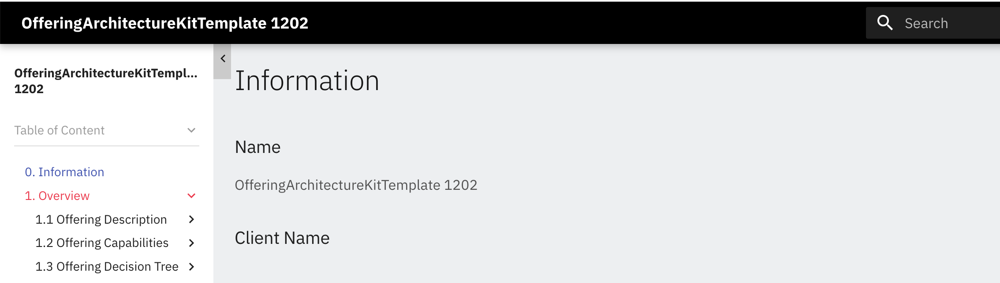
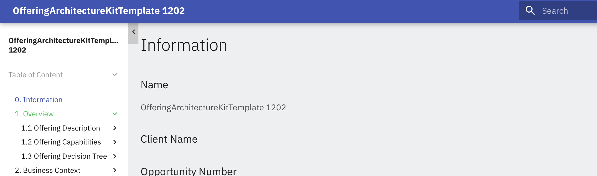
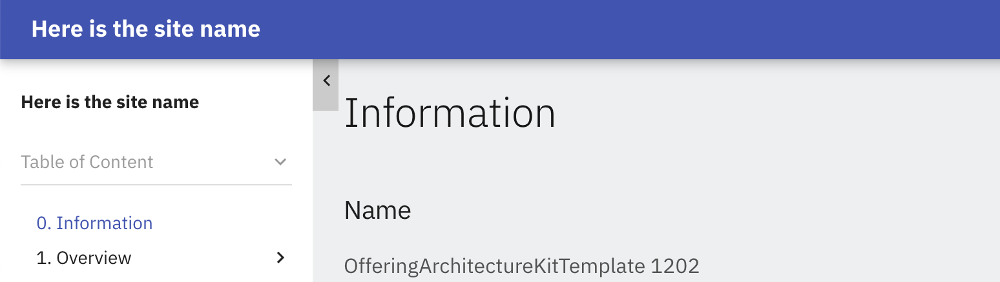
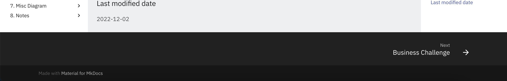
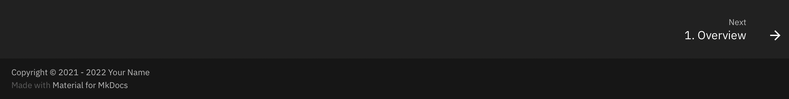
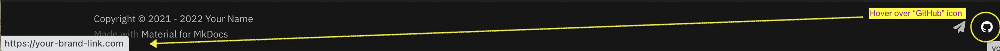
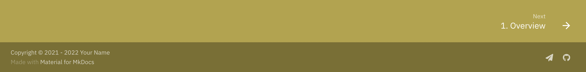

# ITAA_Markdown


## Introduction
This is the markdown repository template for the "Export to GitHub Pages" utility in IBM IT Architect Assistant (aka Cognitive Architect).  

The export utility creates markdown files containing the architecture information and then generates the corresponding GitHub Pages of the architecture using [MkDocs](https://www.mkdocs.org), [ejs](https://ejs.co/), [MkDocs Awesome Pages plugin](https://github.com/lukasgeiter/mkdocs-awesome-pages-plugin) and [Material for MkDocs](https://squidfunk.github.io/mkdocs-material/getting-started/).  

It consists of the following folders:
- docs
- template
  - official_template : contains the architectural artifacts' default [ejs](https://ejs.co/) templates
  - user_template : user-defined templates that overrides the default ones
- theme : contains the [theme](https://squidfunk.github.io/mkdocs-material/customization/#extending-the-theme) used for the generated pages

and files:
- Makefile : for redeploying changes made to the theme and/or markdown files 
- README.md : this page
- mkdocs.yml : configuration file for MkDocs
- requirements.txt : MkDocs dependencies


When the export is successfully executed:
- the markdown files containing the various architectural artifacts and instances will be stored in the `docs` folder AND
- a json file containing all the architecture information (`archData_[architecture-name].json`) will also be created


If there are concerns about who can view/access the generated GitHub Pages, read the [Access Considerations](#access-considerations) section before proceeding.


<hr>

## Setup

Before executing the export utility, you will need the following:
- a GitHub repository to contain the generated markdown docs and GitHub pages
- a GitHub token for access


#### *1. Create a GitHub repository based on a markdown repository template*


#### For Public GitHub setup
- go to the [Public GitHub markdown repository template](https://github.com/IBM/itaa-markdown)
- click on "Use this template" to create a new repository based on the template

- provide a name for your repository, for eg the architecture name that you are exporting from

- click on "Create repository from template"

If you are using GitHub Free, your repository has to be set as public. More information on GitHub Pages configuration [here](https://docs.github.com/en/pages/getting-started-with-github-pages/configuring-a-publishing-source-for-your-github-pages-site).


#### *2. Generate the GitHub token with ***repo***  access. This is needed so that the export utility can generate the appropriate files into your GitHub repo.*

For help on creating the token and getting the repository URL, go to [GitHub Repo URL & Token](#github-repo-token--url).


💡 Tip: At a minimum, each architecture should have its own git repository! If you want to show different content based on your target audience or purpose, export them to different GitHub repositories.


<hr>

## Usage in IBM IT Architect Assistant : Export Utility

1. Go to the Export / Import menu in IBM IT Architect Assistant

2. Select Export and click Next
3. Select GitHub Pages and provide your github repository link and token
4. Click the Export button
5. The Export utility will execute in the background and you will be notified and provided with the link to the published pages when the export is done.


⚠️ Warning: Do not close the browser window after the Export request has been submitted! The URL of your GitHub Pages will be returned when the export is completed.

💡 Tip: You can continue to work in IBM IT Architect Assistant while your Export request is being processed.


If you did not see or get the URL, your GitHub Pages can typically be accessed via:  
`https://pages.{enterprise_github_domain}/{github_account}/{repo_name}/`or  
`https://{github_account}.github.io/{repo_name}/`

If you get a "*404 - Page/File Not Found*" error, check your repository's Settings -> GitHub Pages for the correct URL.


<hr>

## GitHub Repo Token & URL

To generate an access token for your repository:
 - Navigate to [repository-url]/settings/tokens/new (e.g. https://github.ibm.com/settings/tokens/new)
 - Add a description, for e.g. iiaa-access and select *repo* scope
 - Click the "Generate Token" button
 - Click on the clipboard icon (📋) to copy the token and save it somewhere. You will need this in the "Export dialog" in IBM IT Architect Assistant. Note that you cannot retrieve the token from Git after you leave the Token generation page.


For this export function, you have to use the HTTPS repository URL, regardless of whether your target repository is in Enterprise Git or Public Git.

Sample HTTPS URLs are:
 - `https://github.ibm.com/owner-name/IIAA_Markdown_arch1.git` (GHE) 
 - `https://github.com/owner-name/IIAA_Markdown_arch5.git` (Public)

You can retrieve the URL by clicking on the Code button for your repository and copy the HTTPS URL.


<hr>

## Access Considerations

GitHub Pages is designed to host your personal, organization, or project pages from a GitHub repository. In the [GitHub Pages Docs](https://docs.github.com/en/pages/getting-started-with-github-pages/configuring-a-publishing-source-for-your-github-pages-site), the following is called out:

    GitHub Pages is available in public repositories with GitHub Free and GitHub Free for organizations, and in public and private repositories with GitHub Pro, GitHub Team, GitHub Enterprise Cloud, and GitHub Enterprise Server.

It is important to understand who can view the Pages.
- In Public GitHub, since the repository has to be public, anyone can see the generated GitHub Pages
- In Enterprise GitHub, the repository can be private, BUT the *published site will be visible to all enterprise members*.

To limit access to your GitHub Pages, one option is to serve up the pages from a local machine.
- Execute steps 1 through 3 outlined in the [Refreshing your Pages](#refreshing-your-pages-using-command-line-execution) section
- When the `make serve` command is completed, you can view the pages using the URL generated, for eg, `http://127.0.0.1:8000/{github_account}/{repo_name}/`


<hr>

## Customization

The export utility uses [MkDocs](https://www.mkdocs.org) with the [ejs](https://ejs.co/) template engine to generate the markdown files. The [Material for MkDocs](https://squidfunk.github.io/mkdocs-material/getting-started/) theme for [MkDocs](https://www.mkdocs.org) is then used to generate the GitHub Pages.

We chose `ejs` as our template engine because of its performance and ease of understanding since it is closer to pure HTML.


To customize the markdown files:
- Copy the `ejs` file(s) to be changed from the *templates/official_template* folder to the *templates/user_template* one.
  - Note: Do not change the name of the file(s). 
- Modify the content as needed.
- Re-submit the Export request in IBM IT Architect Assistant.


To change the look & feel of your pages:
- refer to Material for MkDocs - Customization](https://squidfunk.github.io/mkdocs-material/customization/) on how to customize the themes
- Re-submit the Export request in IBM IT Architect Assistant.


💡 Tip: If the GitHub Pages do not reflect your latest updates, clear the cache and refresh.


### Customization Examples


#### Theme Customization

1. Copy the `mkdocs.ejs` file to be changed from the *templates/official_template* folder to the *templates/user_template* one. 
   - Do NOT change the name of the file
   - This is REQUIRED to ensure that any theme customization is not overwritten with each Export action. 
2. Modify the content as needed (refer to [Material for MkDocs - Customization](https://squidfunk.github.io/mkdocs-material/customization/) for more information).
3. Re-submit the Export request in Cognitive Architect.


#### Example 1: Change theme color

- The default color generated is **black** with accent color of **red**, as shown in the `mkdocs.ejs` file.
  ```
  palette:
    primary: 'black'
    accent: 'red'
  ```
  

- To change the colors, modify the "palette" in the `mkdocs.ejs` file as shown:
  ```
  palette:
    primary: 'indigo'
    accent: 'green'
  ```
  The updated colors of the banner and accent will be as follows:
  


#### Example 2: Change site name

- The default site name is your architecture name, for e.g. "OfferingArchitectureKitTemplate 1202". This is reflected in the `mkdocs.ejs` file as:
  ```
  site_name: <%=data.archData.name%>
  ```
  

- To change the site name, modify the site_name in the `mkdocs.ejs` file as shown:
  ```
  site_name: Here is the site name
  ```
  


#### Example 3: Add additional information in the footer

- The default footer is as shown:
  

- To add a Copyright in the footer, update `mkdocs.ejs` with the copyright block:
  ```
  copyright:
    Copyright &copy; 2021 - 2022 Your Name

  extra_css:
    - extra.css
  extra_javascript:
    - extra.js
  ```
  

- To add social links, update with the "extra:" block:
  ```
  extra:
    social:
      - icon: fontawesome/solid/paper-plane
        link: mailto:your-email@address.com
      - icon: fontawesome/brands/github
        link: https://yourbrandlink/

  extra_css:
    - extra.css
  extra_javascript:
    - extra.js
  ```

  
  


#### Example 4: Change the footer color

- To change the color of the footer, add the following to the end of the `extra.css` file:
  ```
  .md-footer {
      background-color: #b5a240;
  }
  ```
  


<hr>

## Refreshing Your Pages using Command Line Execution
*---We are in the process of refining this process. Ignore content in this section for now---.*

If you customize the theme and/or *.MD files, instead of using the Export utility in IBM IT Architect Assistant, you can refresh your GitHub Pages with command line executions. Note that `python 3.x` has to be installed on your machine in order to use this approach.

In a terminal window:
1. Download your repository to your local machine
     - see https://docs.github.com/en/repositories/creating-and-managing-repositories/cloning-a-repository for more information
2. In the directory where your repository is, run `make venv` to create the python environment
3. Run `make serve` to start up the MkDocs engine on your local machine
4. Update the docs/*.md files as needed
5. Commit changes to your repository
6. Run `make deploy` to deploy the changes


⚠️ Warning: If there are updates to your architecture after executing the Export function, DO NOT USE this approach. Run the Export utility in IBM IT Architect Assistant to generate the latest updates.


## Feedback and Contributions

We are always looking for feedback and contributions.  

- If you have any *suggestions* to the documentation or *contributions*, please submit a *Pull request* with your suggested changes or contributions.
- If you have *general* feedback and comments, please open a *New Issue*.

Your participation is greatly appreciated.
